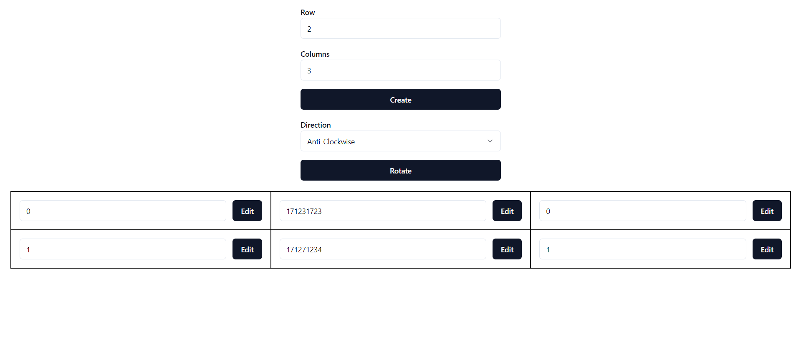

# Rotate-Table
Build a webapp that create table view and rotate it in React.



## Tasks
Build a webapp that create table view and rotate it in React.

- User should be able to input row and column counts as Number
- User should be able to select the rotate direction and perform rotation every time user clicks the rotate button
- User should be able to populate the table in responsive manner and create/update/delete the content of each cell
- All the data related to table content and metrics should be fetched from the backend

## Environment
- Windows 11
- Node v20.15.1
- Npm 10.7.0

## Tech stacks
- Vite + React + Typescript
- Express
- Radix UI
- Tailwind CSS
- Shadcn UI
- React Query

## Steps to run program
1. Install node modules
   ```shell
   npm install
   ```

2. Run project
   ```shell
   npm run dev
   ```
This will host the project on http://localhost:3000.
